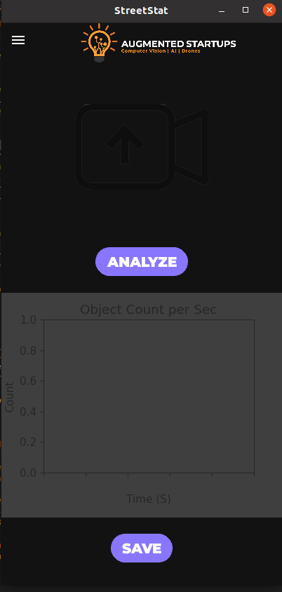
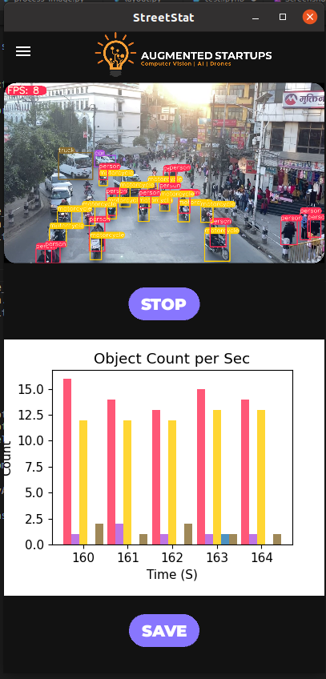
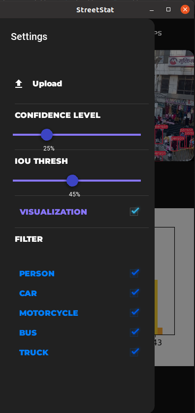
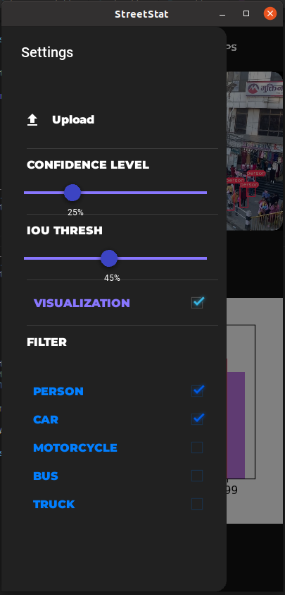
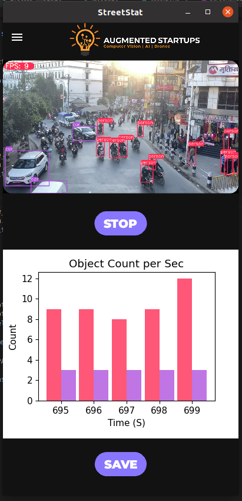

# StreetStat

StreetStat is an app that allows you to analyze traffic patterns and vehicle usage by detecting and counting vehicles and people in real-time. This app uses computer vision techniques to detect objects in video streams from cameras placed at various locations. The app supports the detection and counting of people, cars, motorcycles, buses, and trucks.

# Installation
To install the app, follow these steps:

- Clone the repository to your local machine.
- Install the required packages by running pip install -r requirements.txt.
- Run the app by running python main.py.

# Usage

To use the app, follow these steps:

- Open the app by running python main.py.
- Select the classes of objects that you want to detect and count (e.g., people, cars, etc.).
- Adjust the confidence and IOU thresholds to control the accuracy of the detection.
- Start the app by clicking the "ANALYZE" button.
- Point the camera to the traffic scene you want to analyze.
- The app will start detecting and counting objects in real-time.
- The app will display a bar chart showing the counts of objects for each frame.
- To stop the app, click the "STOP" button.

# Features

- Object detection technology to count vehicles
- Real-time data and analytics
- Historical data and trend analysis
- Customizable settings and filters

## Screenshots

